# Lyft Perception Challenge

*This repository presents my solution to the Lyft & Udacity Perception challenge. A neural network based on the U-net architecture has been developed and trained to perform semantic segmentation on frames taken from a car front facing camera.*

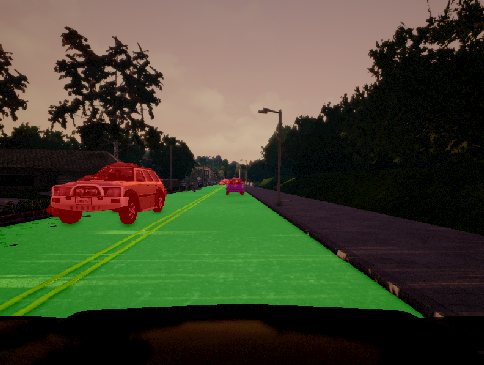

*Sample frame overlayed with output from neural network for car (red) and road detection (green)*

## Objective

Lyft and Udacity have created a challenge related to the application of semantic segmentation in self-driving cars. The objective is to be able to identify at a pixel level cars and road from a camera located at a front of the car.

The data is created through a simulator able to generate high quality pictures with the corresponding ground truth label. This let us design and evaluate conveniently an algorithm that can later be refined with real data.

The scoring is based on the *F-score*, also known as *Sørensen–Dice index*, and is calculated from recall and precision.

The generalized formula is defined as:

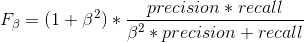

*β = 2* when scoring vehicles while *β = 0.5* when scoring the road. It means that when detecting vehicles, we give a higher importance to recall, ie we do not want to miss any vehicle. When detecting the road, we give a higher importance to precision, ie we want to be sure that we select a driveable area.

Finally, the implementation needs to be able to process 10 frames per second on the test machine to avoid any penalty.

## Data collection

The data is collected through the [Carla simulator](http://carla.org/). It simulates realistic driving environment and surroundings.

The simulator can create data from a large range of sensors, including cameras, and is used to automatically generate ground truth labels associated to our data. The below picture represents a sample image from a simulated camera as well as the ground truth semantic segmentation which identifies each type of pixel (road, car, pedestrian, etc).

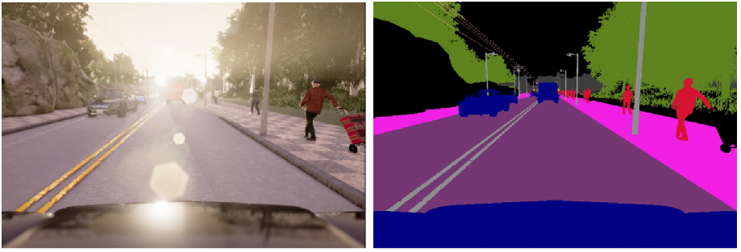

The data initially provided contains a 1000 samples and is not sufficient to reach good results and prevent over-fitting. It has been used as validation set, making it completely independent from our collection process.

In order to cover as many situations as possible, data was collected from 10 iterations in each defined weather (15 conditions can be simulated). About 250 frames were collected from every continuous scene. This ensures that many different combinations of cars, people (whether crossing the road or on the side), locations, weather and light are represented. In total, this is about 20 Go of data and 37,350 images.

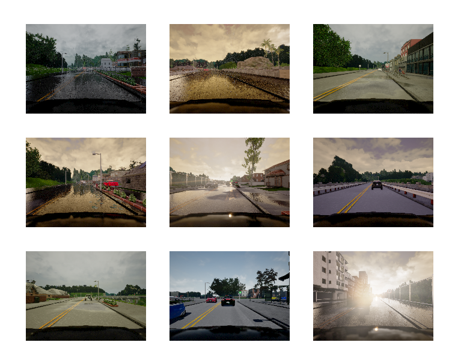

Initially, the data was augmented with different techniques but I realized it was not needed if we generated enough samples. In addition, none of them proved interesting enough. For example, samples were randomly flipped horizontally but the new view generated was not a case that could apply during final testing in this particular challenge.

For real images, we would augment the data to generate different car orientations, camera positions, lighting, camera sensor noise…

## Network architecture

The general network architecture is based on [U-net](https://arxiv.org/pdf/1505.04597.pdf) and is represented here below.

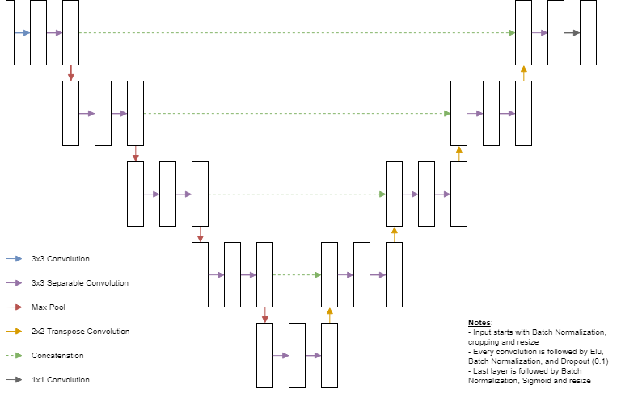

A few important highlights are important to note:

- the input image is cropped to eliminate the sky and the car hood and then the x axis is downsized by a factor 2 in order to have an inference fast enough (> 10 fps) ;

- several convolution layers have been replaced with separable convolutions inspired by the [MobileNets](https://arxiv.org/pdf/1704.04861.pdf) in order to decrease the number of training parameters ;

- [Batch normalization layers](https://arxiv.org/pdf/1502.03167.pdf) are used: after every convolution, after loading the input image, and prior to final sigmoid layer in order to help transmit the gradient during training ;

- [Dropout](https://www.cs.toronto.edu/~hinton/absps/JMLRdropout.pdf) layers are used after every convolution except for the last layer to help generalize the network ;

- [ELU functions](https://arxiv.org/pdf/1511.07289.pdf) are used instead of the traditional ReLU functions to avoid having too many "dead" neurons during training.

For semantic segmentation, it is usually preferable to apply a sigmoid instead of softmax (more common for classification problems). In this particular case, we output 2 different classes representing the probability of the pixel belonging to a car or road.

It is interesting to observe that a pixel could be in one of the two classes, in none of them, or even in both of them since they are treated separately.

## Loss definition

The loss to minimize during training was defined such as it approximates the scoring loss of the challenge while still being differentiable (which is not the case of the scoring). It let the neural network optimize directly the real measured loss, instead of improving it indirectly through regular softmax cross-entropy.

We first replace prediction and recall in the *F-score* function with their definition. We approximate true positive as the sum of the products of labels with the sigmoid logits. Also we consider the union of two sets as their sum, even if we count twice the same elements. These assumptions lead to the following differentiable score:

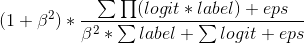

We add a small term to nominator and denominator to handle numerical stability and cases where no detected pixel or ground truth pixel is present.

The loss is simply the opposite of the score. We scale and offset it just to have the loss in the [0, 1] interval for monitoring purposes but it does not affect the training.

## Training

The training is performed with Adam optimizer. When the training & validation losses don't improve any more, we decrease the learning rate in order to fine-tune the weights.

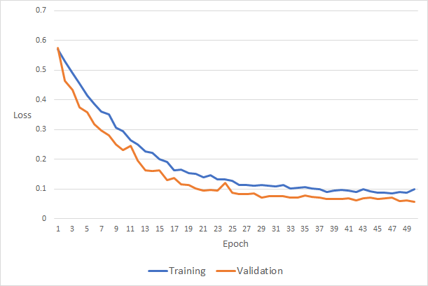

The validation loss can sometimes appear noisy but it is likely due to the fact that the 1,000 samples are actually taken from only 5 different continuous scenes with few variation in weather and position. When looking at sequential frames, they are very close to each other: the car in front may move at the same speed and look the same for several dozens of frames.

It is interesting to note that the validation loss is lower than the training loss. At the start of training, it can be justified because the training loss is the mean of the losses from all the batches during one epoch and keep on improving while the validation loss is based on the network at the last epoch only. However when the network stagnates, the validation loss is still lower than the training loss, which is either be due to the dropout layers or from the fact that it runs on more "simple" data than the testing data.

We can see that the network does not over-fit as the validation data has never been seen by the network during testing. It demonstrates that the training data accumulated previously is sufficient for the network.

## Development of network architecture

Several iterations of the neural network were developed and trained. Here are a few attempts that were made during the development of the network but not implemented in the final version:

- The number of layers and resizing of input image were initially respectively set at 3 and 128x128 for quick prototyping. Final network keeps full resolution in the vertical axis and divides the horizontal axis by two. The objective is to let the network see as many details as possible. The resolution is decreased only to guarantee a speed of 10 fps minimum during inference process. Training of the larger network was performed remotely on an instance with Nvidia Quadro P5000.

- A sliding window approach was developed but did not lead to satisfactory results. When observing some of below samples, we can see that it can sometimes be difficult to differentiate road and sidewalk as we are missing part of the context. Also cars are cropped making it more difficult to learn their entire representation. 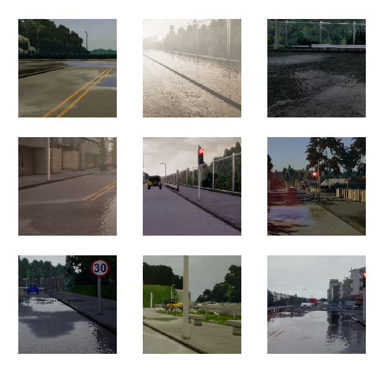

- We used L2 regularization but the results became worse. The paper *[L2 Regularization versus Batch and Weight Normalization](https://arxiv.org/pdf/1706.05350.pdf)* shows that L2 may have limited regularization effect when used with other regularization methods and can affect weight and learning rates.

- We tested an *[Inverted Net](https://arxiv.org/pdf/1701.08816.pdf)* which decreases significantly the number of parameters by having an opposite effect on number of layers as *U-net*. It starts with a high numbers of layers and decreases when going deeper. However it did not perform well, which is potentially because the number of initial filters had to be decreased to only 128 (vs 256 in the paper) so that all the training matrices fit in memory.

- We trained a network without dropout. We realized that the quantity of data we had generated was much higher than the data we see during an epoch of training. An epoch lasts 8mn and processes about 10,000 frames, 7 at a time (GPU limitations). However it resulted in over-fitting showing that even with a lot of data, we quickly over-fit without any form of regularization such as dropout or L2 on weights.

Here are a few ideas that were not tested due to lack of time:

- Represent images in other spaces than RGB such as HSV to see if it helps the network ;

- Replace separable convolution layers with regular convolution layers ;

- Modify dropout strategy: at the moment we drop 10% of neurons in full network (except on output layer) while we could try different possibilities ;

- Add a fourth channel to the image corresponding to the gray scale and try to train only on this channel or on all four channels (RGB + gray) ;

- Balance the training samples based on their current F-score through probability sampling or weighing score ;

- Optimize separate networks for car and road detection ;

- Use pre-trained networks (such as VGG) for the contraction part of the architecture ;

- Collect even more data! Even though the number of training samples is high, they come from continuous sequences, limiting their diversity. This time we would collect data from a lot of short and independent sequences.

## Results

We use the output of the final sigmoid layer as our output. It produces 2 frames corresponding to each class (road and car) with values in the range [0, 1] that we interpret as the probability of belonging to associated class. We identify every value above 0.5 as corresponding to evaluated class.

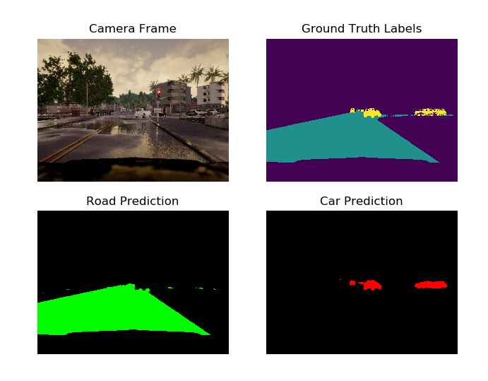

The neural network performs at a F-score of about 92-93% on our data-set with an inference of about 13 frames per second, detecting relatively well cars and road.

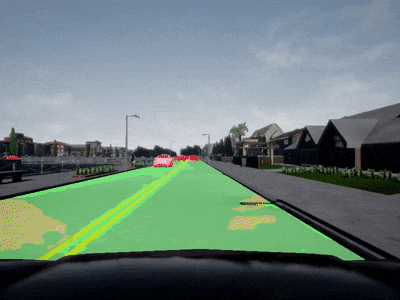

This score is not sufficient for real life application in a self-driving car. When analyzing test frames, we can sometimes find some mislabelled, which is not acceptable for a Level 5 self-driving car. On below sample, the car on the left is not fully identified and there are a few issues in labeling the road going towards the right.

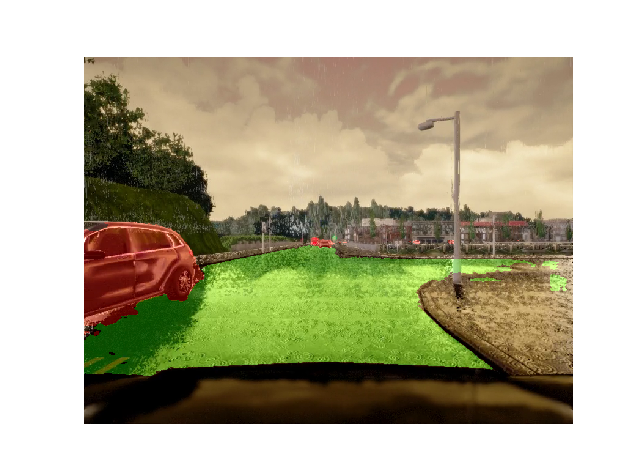

It is important to note that the simulation only helps for prototyping our neural network. It could not be used directly on real data without being retrained on a much larger data-set from the real world. As expected, it leads to poor results when using a real photo as can be seen here below.

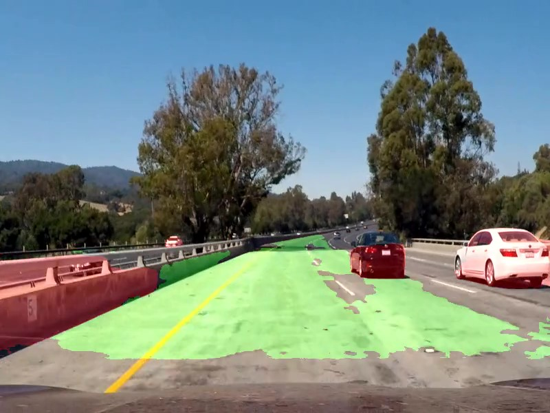

The present results are nevertheless promising and demonstrate the potential of semantic segmentation on self-driving cars. The neural network was developed through numerous attempts and was optimized by implementing and testing every possible idea I had during the challenge. It would be worthwhile to perform trials of every untested idea previously mentioned in order to improve further the model.

## Usage

Prerequisites:

- Data needs to be collected from Carla simulator and split between training and validation.

- Program developed with python 3.6 and Tensorflow 1.8. With all possible drivers, CUDA, cuDNN and compute capability versions, it is recommended to learn how to compile and build Tensorflow from sources.

The setup script `preinstall_script.sh` has been developed for setting Udacity workspace environment.

The script `src/train.py` is used to define main hyper-parameters of the neural network and perform training.

When training is completed and results are satisfactory, we can "freeze" the model:

    python src/freeze.py path_to_model

 It creates a file that contains only the parameters used for inference and removes all the operations used for training. The size of the model is therefore reduced, and the speed of inference improves. A saved model has been provided as `Model/frozen_model.pb`.

Finally, inference is performed using:

    python src/run.py path_to_video

It prints out encoded resulting inference for evaluation.